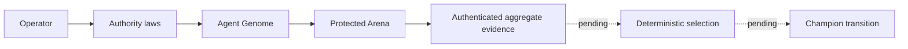

# Hephaestus

Hephaestus is an evidence-first evolutionary control plane for AI agents.



The repository now has an executable constitution, durable evidence spine, fail-closed Genome and World compilers, runnable local control plane, provider-neutral runtime substrate, provenance-backed Experience Plane, and a deterministic measurement-only Arena. `crates/hephaestus-core/` owns authority and domain Laws. `crates/hephaestus-ledger/` owns canonical events and artifacts. `crates/hephaestus-genome/` derives immutable identities. `crates/hephaestus-control/` provides the single-writer daemon and operator CLI, including real non-billable `hephaestus run <genome-id>` and `hephaestus arena evaluate <evaluation-id> <parent-id> <candidate-id>`. The paired command loads World-owned visible and sealed inputs, pins one source revision, runs both Genomes through separately cleaned supervised processes, invokes the exact World-hashed evaluator, and returns only visible aggregates. `crates/hephaestus-runtime/` creates private pinned Git worktrees, expiring run-bound capabilities, independently supervised local processes with hard wall/output limits, fail-closed macOS Seatbelt isolation, and inert Codex/Claude invocation contracts. `crates/hephaestus-experience/` wraps runtimes with required redacted lifecycle evidence, owns the daemon-signed canonical run-result schema, and reconstructs trusted redacted Experience capabilities only from canonical event/CAS provenance after restart. `crates/hephaestus-arena/` resolves task outputs only from authenticated result events, enforces exact task/input/seed/environment/budget pairing, binds the verifier/evaluator/manifests through the compiled World, and records idempotent receipts. Terminal failures remain attributable paired evidence: they count as unreliable and incorrect while retaining authenticated cost and latency. Candidate-facing summaries contain only visible aggregates; a separate operator capability mints event-hash-bound correctness, reliability, cost, latency, and outcome aggregates and rehydrates them from verified history after restart without exposing task-level or sealed payloads. Deterministic selection and Champion transitions remain pending. CI deliberately breaks each implemented invariant and requires the suite to detect the regression.

## Development

Install the stable Rust toolchain with the `clippy`, `rustfmt`, and `llvm-tools-preview` components, plus `cargo-llvm-cov`. Then run:

```bash
cargo fmt --all -- --check
cargo clippy --workspace --all-targets --all-features
cargo test --workspace
PYTHONPATH=python python3 -m unittest discover -s python/tests -v
cargo llvm-cov --workspace --all-features --lcov --output-path lcov.info
python3 checks/coverage_gate.py --manifest checks/checks.json --report lcov.info
python3 checks/mutation_guard.py --manifest checks/checks.json --assert-min 212
python3 checks/docs_gate.py --root . --min-diagrams 1 README.md docs/ARCHITECTURE.md
```

The full product and engineering specification is in [HEPHAESTUS_MASTER_PLAN.md](HEPHAESTUS_MASTER_PLAN.md).

The executable vocabulary is grounded by the [Constitution](docs/CONSTITUTION.md), [Threat Model](docs/THREAT_MODEL.md), [Terminology](docs/TERMINOLOGY.md), and [Evaluation Philosophy](docs/EVALUATION_PHILOSOPHY.md). Runtime behavior is specified in [Runtimes and Sandboxes](docs/RUNTIMES.md), evidence behavior in [Traces and Experience](docs/EXPERIENCE.md), operator behavior in the [Control Plane](docs/CONTROL_PLANE.md), and compiler contracts in [Genomes](docs/GENOMES.md) and [Worlds](docs/WORLDS.md).
