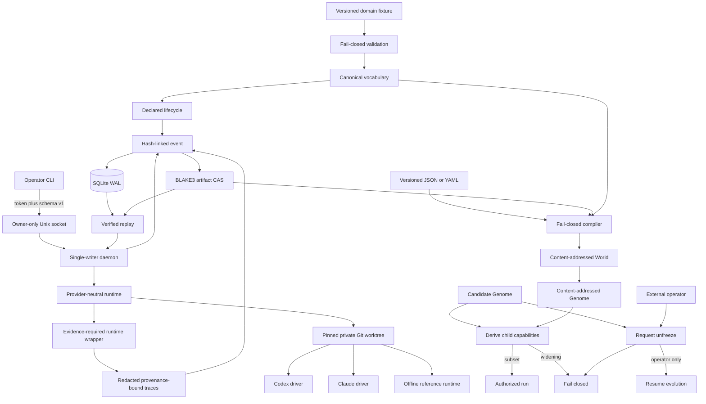

# Architecture

The Rust workspace separates Laws and domain contracts, canonical evidence persistence, immutable Genome/World compilation, the local daemon boundary, capability-scoped runtimes, and the Experience Plane. New planes are added only with executable invariants.

## Trust boundary

The authority, domain, compiler, Genome, World, event-store, artifact-store, runtime, isolation, control, and Experience modules named by `checks/checks.json` are production-critical. The manifest sets a 95% per-module coverage floor and deliberate source mutations for implemented invariants. The mutation ratchet may only increase.

## Repository map

- `crates/hephaestus-core/` — shared trust primitives.
- `crates/hephaestus-control/` — daemon, versioned local API, and operator CLI.
- `crates/hephaestus-experience/` — redacted traces, runtime evidence integration, and provenance-backed experience.
- `crates/hephaestus-genome/` — canonical Genome and World compilers.
- `crates/hephaestus-ledger/` — canonical events and artifacts.
- `crates/hephaestus-runtime/` — capability-scoped worktrees and runtime adapters.
- `checks/` — coverage, mutation, and documentation gates.
- `.github/workflows/ci.yml` — deterministic and adversarial CI jobs.
- `HEPHAESTUS_MASTER_PLAN.md` — product and engineering specification.
