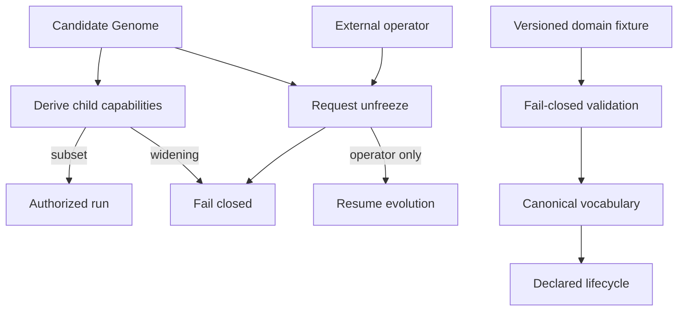

# Architecture

The Rust workspace begins with `crates/hephaestus-core/`, which owns laws and domain contracts that must remain outside evolution. Other planes will be added only after their invariants have executable evidence.

## Trust boundary

The authority and domain modules are treated as production-critical. `checks/checks.json` sets a 95% per-module coverage floor and defines deliberate source mutations for each implemented invariant. The mutation ratchet may only increase.

## Repository map

- `crates/hephaestus-core/` — shared trust primitives.
- `checks/` — coverage, mutation, and documentation gates.
- `.github/workflows/ci.yml` — deterministic and adversarial CI jobs.
- `HEPHAESTUS_MASTER_PLAN.md` — product and engineering specification.
