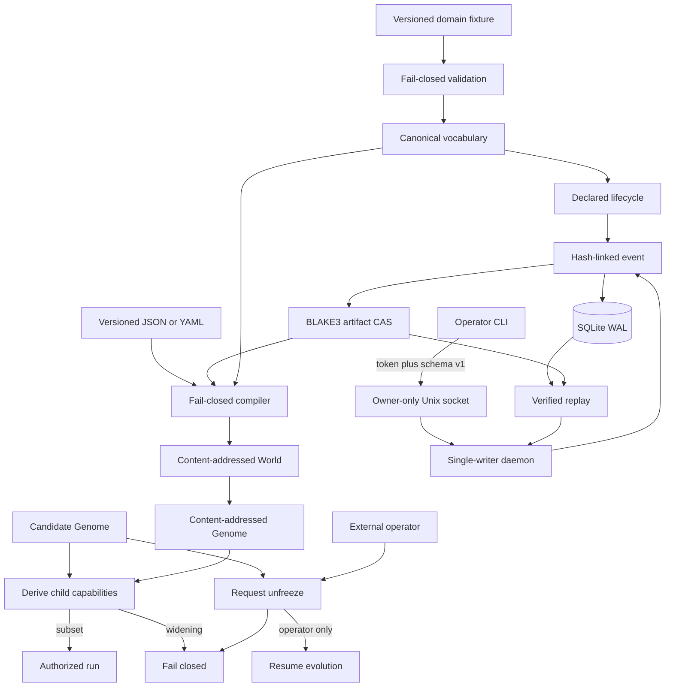

# Architecture

The Rust workspace begins with `crates/hephaestus-core/`, which owns Laws and domain contracts, `crates/hephaestus-ledger/`, which owns canonical evidence persistence, `crates/hephaestus-genome/`, which compiles immutable Genomes and Worlds, and `crates/hephaestus-control/`, which owns the local daemon boundary. Other planes will be added only after their invariants have executable evidence.

## Trust boundary

The authority, domain, compiler, Genome, World, event-store, and artifact-store modules are production-critical. `checks/checks.json` sets a 95% per-module coverage floor and defines deliberate source mutations for each implemented invariant. The mutation ratchet may only increase.

## Repository map

- `crates/hephaestus-core/` — shared trust primitives.
- `crates/hephaestus-control/` — daemon, versioned local API, and operator CLI.
- `crates/hephaestus-genome/` — canonical Genome and World compilers.
- `crates/hephaestus-ledger/` — canonical events and artifacts.
- `checks/` — coverage, mutation, and documentation gates.
- `.github/workflows/ci.yml` — deterministic and adversarial CI jobs.
- `HEPHAESTUS_MASTER_PLAN.md` — product and engineering specification.
