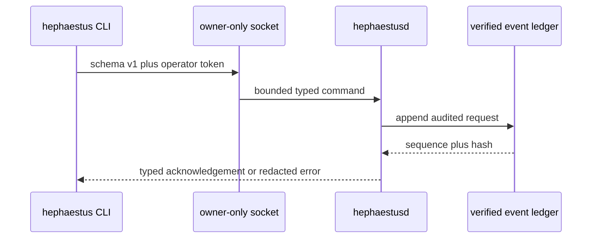

# Local Control Plane

`hephaestusd` is the only process allowed to mutate canonical local state. It takes an advisory exclusive lock, verifies the complete hash-linked ledger plus every registered Genome, World, trace, and run-result artifact, reconstructs the control projection, and only then binds an owner-only Unix socket. The data directory and artifact root are mode 0700; the socket, database, lock, and 256-bit operator token are mode 0600.



## Operator commands

The CLI defaults to `HEPHAESTUS_HOME`, then the user's `.hephaestus` directory. A specific data directory can be supplied with `--data-dir`.

```bash
hephaestus status
hephaestus freeze
hephaestus unfreeze
hephaestus kill --all
hephaestus genome show <id>
hephaestus run <genome-id>
hephaestus replay
hephaestus daemon stop
```

`freeze`, `unfreeze`, and `kill --all` are canonical events, so restart reconstructs their effects. `replay` independently reloads and verifies history, rebuilds the projection, compares it with live state, and reports a content hash. Genome inspection only returns immutable records whose identity is bound to verified CAS bytes.

`run` requires an unfreezed daemon, a registered Genome, and that Genome's exact registered World. The daemon fixes the source repository at startup, generates the run ID, narrows authority to read-only/offline, and hands exclusive ownership of the canonical ledger and CAS to the evidence recorder for the synchronous run. The deterministic adapter inventories an isolated worktree; the daemon stores bounded stdout/stderr in CAS, appends a provenance-bound result receipt, cleans the worktree, and returns only terminal metadata and artifact IDs. Trace lifecycle receipts drive active-run projection and remain terminal after restart.

## Fail-closed boundaries

Requests are capped at 64 KiB, strictly deserialized, version checked, and authenticated before any consequential action. Authenticated typed requests—including invalid identifiers—are ledgered; malformed or unauthenticated traffic cannot grow canonical history. Replay requires control events to name the exact operator actor and aggregate and to carry a command matching the event type. Transport errors are isolated to one connection, and idle reads and writes are time bounded.
