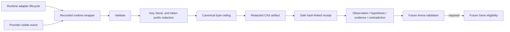

# Traces and Experience

`crates/hephaestus-experience/` is the pre-persistence evidence boundary. Runtime observations arrive as structured fields, are redacted and bounded, then become canonical JSON artifacts in the BLAKE3 content-addressed store. The hash-linked event ledger receives only a compact receipt containing the artifact address and immutable run, Genome, and World provenance.

## Trace contract

The trace vocabulary covers lifecycle start/completion, tools and results, context composition, memory retrieval, subagents, file activity, tests, denials, cost, checkpoints, errors, retries, and model responses exposed to the runtime. It does not request or store hidden chain-of-thought. Provider prompts and output must arrive as explicit observable fields.

`RecordedRuntime<R>` decorates any provider-neutral runtime adapter. It automatically persists starts, terminal states, adapter-owned completion reasons and elapsed time, resume checkpoint hashes, adapter errors, capability denials, known deterministic zero cost, and typed provider-visible observations. Lifecycle and cost records cannot be injected through the observation API, callers cannot mutably bypass the wrapper, and draining the wrapper cannot consume unrecorded inner events. Prompts and raw checkpoint values are not recorded. Running polls create no synthetic checkpoints and always preserve one retention slot for terminal evidence. Resume can replace only a fully evidenced terminal wrapper state with the exact same run, Genome, and World provenance, regardless of what the inner adapter would permit.

If required lifecycle or observation evidence cannot persist, the wrapper interrupts the inner runtime. Drained observations remain buffered until each canonical append succeeds, so a later terminal snapshot cannot silently omit an evidence gap. Confirmed cleanup removes the run; a failed interrupt leaves a typed containment-failed run addressable for retry. Failures while recording adapter errors use the same containment path. Terminal wrapper state is committed only after the canonical terminal receipt persists, and repeated terminal snapshots are idempotent.

Every record carries non-empty bounded `run_id`, `genome_id`, and `world_id`. Retention limits cap the combined number of trace and experience records per run and the canonical bytes of each artifact. Reopening the recorder reconstructs counts from verified ledger history, so restart cannot reset a ceiling.

## Redaction boundary

Sensitive field names are replaced wholesale. Runtime-known secret literals and common credential prefixes such as bearer tokens, OpenAI-style keys, GitHub tokens, and Slack tokens are removed from otherwise safe fields. Redaction happens before CAS storage and before the ledger receipt is serialized. Full redacted artifacts remain tamper-evident through their content addresses.

## Experience contract

An experience is one of `observation`, `hypothesis`, `evidence`, or `contradiction`. It must cite canonical trace or experience event IDs with exactly matching run, Genome, and World provenance. Referenced evidence artifacts must exist and pass their content hash. Contradictions require at least two sources and remain explicit rather than overwriting either side.

Every experience is durably marked `unverified`. This crate intentionally has no Gene creation or promotion operation: only a future Arena evidence receipt may establish Gene eligibility.
