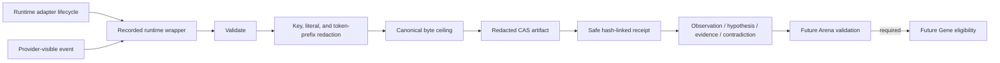

# Traces and Experience

`crates/hephaestus-experience/` is the pre-persistence evidence boundary. Runtime observations arrive as structured fields, are redacted and bounded, then become canonical JSON artifacts in the BLAKE3 content-addressed store. The hash-linked event ledger receives only a compact receipt containing the artifact address and immutable run, Genome, and World provenance.

## Trace contract

The trace vocabulary covers lifecycle start/completion, tools and results, context composition, memory retrieval, subagents, file activity, tests, denials, cost, checkpoints, errors, retries, and model responses exposed to the runtime. It does not request or store hidden chain-of-thought. Provider prompts and output must arrive as explicit observable fields.

`RecordedRuntime<R>` decorates any provider-neutral runtime adapter. It automatically persists starts, terminal states, completion reasons, latency, checkpoints, adapter errors, capability denials, and known deterministic zero cost. Provider adapters submit their visible tool, context, memory, subagent, file, test, retry, and response events through the same provenance-bound `record_observable` boundary. Prompts and raw checkpoint values are not recorded; checkpoint identifiers are hashed. If required start or resume evidence cannot persist, the wrapper interrupts the inner runtime and removes the run from its observable registry.

Every record carries non-empty bounded `run_id`, `genome_id`, and `world_id`. Retention limits cap the combined number of trace and experience records per run and the canonical bytes of each artifact. Reopening the recorder reconstructs counts from verified ledger history, so restart cannot reset a ceiling.

## Redaction boundary

Sensitive field names are replaced wholesale. Runtime-known secret literals and common credential prefixes such as bearer tokens, OpenAI-style keys, GitHub tokens, and Slack tokens are removed from otherwise safe fields. Redaction happens before CAS storage and before the ledger receipt is serialized. Full redacted artifacts remain tamper-evident through their content addresses.

## Experience contract

An experience is one of `observation`, `hypothesis`, `evidence`, or `contradiction`. It must cite canonical trace or experience event IDs with exactly matching run, Genome, and World provenance. Referenced evidence artifacts must exist and pass their content hash. Contradictions require at least two sources and remain explicit rather than overwriting either side.

Every experience is durably marked `unverified`. This crate intentionally has no Gene creation or promotion operation: only a future Arena evidence receipt may establish Gene eligibility.
