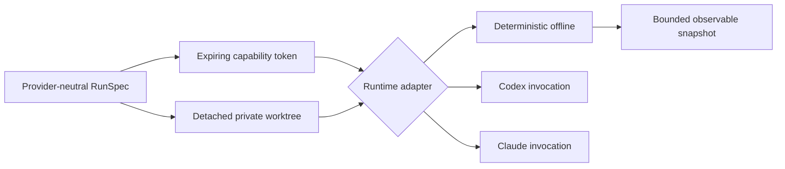

# Runtimes and Sandboxes

`crates/hephaestus-runtime/` keeps provider mechanics outside Genome semantics. Every `RunSpec` binds a Genome, World, prompt, source repository, explicit capabilities, and non-zero wall/output/cost budget. The sandbox manager creates a private detached Git worktree, a separate execution directory, and a non-cloneable 256-bit capability token bound to the run and an expiry.

## Lifecycle contract

Adapters report enforceable capabilities and implement start, resume, interrupt, and snapshot. Snapshots expose status, exit code, bounded stdout/stderr artifact paths, and assigned authority—never hidden chain-of-thought. The deterministic adapter inventories tracked regular files by path, size, and BLAKE3 hash inside the worktree. It provides a non-billable reference path for CI and fails on network widening, expired or cross-run tokens, and output-budget overflow.

## Hosted drivers

Codex and Claude Code invocation builders are pinned to the locally inspected non-interactive CLI contracts. Prompts travel over stdin rather than the process list. Codex uses ephemeral mode, a workspace-derived sandbox mode, and explicit network policy. Claude uses safe mode, no session persistence, explicit tools, `dontAsk`, streaming JSON, and a six-decimal hard cost ceiling.

The builders are deliberately inert in this checkpoint. Live hosted execution may consume paid quota or credentials and therefore requires a separate explicit execution permit. External OS sandbox enforcement and supervised provider processes are the remaining work in the runtime roadmap item; the offline reference runtime does not access credentials or the network.
