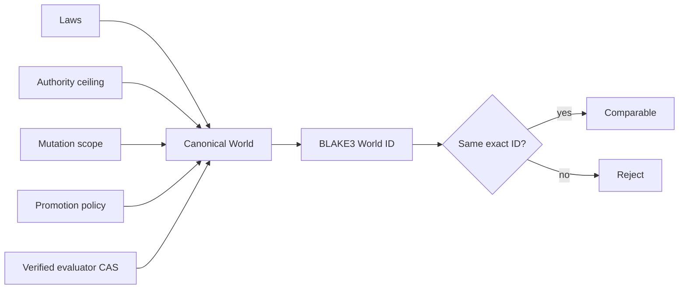

# Worlds

A World is the versioned root of evaluation semantics. Its content-derived identity includes Laws, the authority ceiling, mutation scope, promotion policy, objectives, and evaluator artifact references. Changing any normalized field creates a different World.

## Compilation contract

The schema 1 compiler rejects candidate evaluator access, mutation scopes containing Laws or evaluators, confidence outside 1 through 10,000 basis points, empty or blank objectives, and missing or corrupted evaluator artifacts. It sorts and deduplicates mutation targets and objectives before producing canonical JSON and `hephaestus:world:<blake3>`.

Evaluator artifacts are verified through the same content-addressed store used by Genomes. Candidates receive identities and policy outcomes, never evaluator bytes or hidden scoring internals.

## Comparability

Results are directly comparable only when their compiled World identities match exactly. A name match is deliberately insufficient: changed Laws, evaluation artifacts, objectives, or promotion semantics begin a new progress line.
